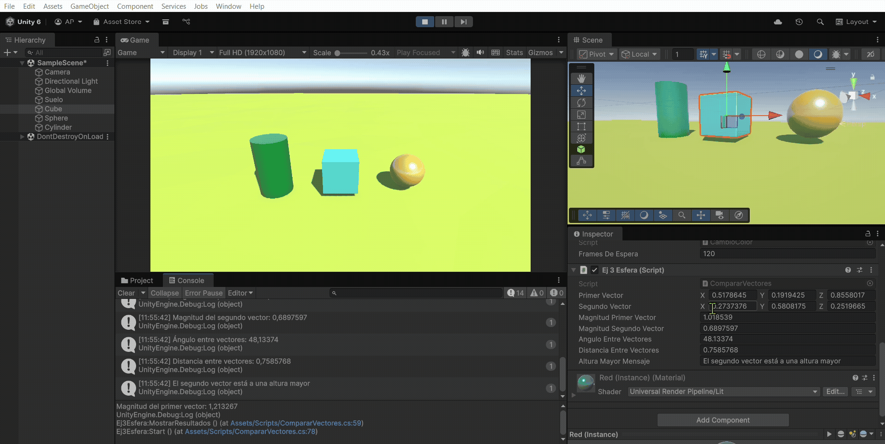

## Introducción a Scripts
* Álvaro Pérez Ramos
* alu0101574042@ull.edu.es

> [!WARNING]  
> Los gifs tardan un poco en cargar al abrirlo desde GitHub.

## Índice 

1. [Ejercicio 1](#uno)
2. [Ejercicio 2](#dos)
3. [Ejercicio 3](#tres)
4. [Ejercicio 4](#cuatro)
5. [Ejercicio 5](#cinco)
6. [Ejercicio 6](#seis)
7. [Ejercicio 7](#siete)
8. [Ejercicio 8](#ocho)
9. [Ejercicio 9](#nueve)
10. [Ejercicio 10](#diez)
11. [Ejercicio 11](#once)
12. [Ejercicio 12](#doce)
13. [Ejercicio 13](#trece)

## Tareas realizadas

### Ejercicio 1 

1. _Crea un script asociado a un objeto en la escena que inicialice un vector de 3 posiciones con valores entre 0.0 y 1.0, para tomarlo como un vector de color (Color)._ 
	* Cada 120 frames se debe cambiar el valor de una posición aleatoria y asignar el nuevo color al objeto. 
	* Parametrizar la cantidad de frames de espera para poderlo cambiar desde el inspector.

Se ha añadido el script: [ej1-II.cs](./p02-movimientos/scripts/ej1-II.cs). 

* [Serialización](https://docs.unity3d.com/Manual/script-Serialization.html)
* [Random](https://docs.unity3d.com/Manual/class-Random.html)
* [Renderer](https://docs.unity3d.com/ScriptReference/Renderer.html)
* [Color](https://docs.unity3d.com/ScriptReference/Color.html)

### Ejercicio 2 

2.  _Crea un script asociado a la esfera con dos variables Vector3 públicas. Dale valor a cada componente de los vectores desde el inspector. Muestra en la consola:_
	* La magnitud de cada uno de ellos. 
	* El ángulo que forman
	* La distancia entre ambos.
	* Un mensaje indicando qué vector está a una altura mayor.
	* Muestra en el inspector cada uno de esos valores

* [Vector3](https://docs.unity3d.com/ScriptReference/Vector3.html)

Se han creado las variables pedidas más unas variables que se usan para mostrar los resultados en el inspector.
Se puede ver el código del script en [ej2-II.cs](./p02-movimientos/scripts/ej2-II.cs).
En el gif se puede ver cómo están las variables en el inspector y cómo se muestran los resultados por consola.

### Ejercicio 3 

3. Muestra en pantalla el vector con la posición de la esfera.

* [Transform](https://docs.unity3d.com/ScriptReference/Transform.html)

Este ejercicio es muy similar al de la práctica anterior. 
El script está en [ej3-II.cs](./p02-movimientos/scripts/ej3-II.cs). 
En la ejecución se muestra por consola la posición actual de la esfera (y se comprueba que es igual a la del inspector).

.

### Ejercicio 4 

4. _Crea un script para la esfera que muestre en consola la distancia a la que están el cubo y el cilindro._

Para poder hacer este ejercicio se han buscado los objetos por su etiqueta.
Se llama a la función "Distance" de la clase Vector3 con las posiciones. 
Se puede ver en el script: [ej4-II.cs](./p02-movimientos/scripts/ej4-II.cs). 

.

### Ejercicio 5 

5.  _Selecciona tres posiciones en tu escena a través de un objeto invisible (marcador) que incluya 3 vectores numéricos para configurar posiciones en las que quieres ubicar los objetos en respuesta a pulsar la barra espaciadora._ 
  * Estos vectores representan un desplazamiento respecto a la posición original del objeto. 
  * Crea un script que ubique en las posiciones configuradas cuando el usuario pulse la barra espaciadora.

En este apartado se ha usado un componente del tipo "Variable". En él, se ha añadido el desplazamiento.
Se puede apreciar en el gif ese componente (en la zona del inspector).
El script que se encarga de detectar si se ha pulsado el espacio y de sumar el desplazamiento es [ej5-II.cs](./p02-movimientos/scripts/ej5-II.cs).

* [Class Variables](https://docs.unity3d.com/Packages/com.unity.visualscripting@1.9/api/Unity.VisualScripting.Variables.html)
* [Input.GetAxis()](https://docs.unity3d.com/ScriptReference/Input.GetAxis.html)

.

### Ejercicio 6 

6. _Agrega un campo velocidad a un cubo y asígnale un valor que se pueda cambiar en el inspector de objetos._ 
  * Muestra la consola el resultado de multiplicar la velocidad por el valor del eje vertical y por el valor del eje horizontal cada vez que se pulsan las teclas flecha arriba-abajo ó flecha izquierda-derecha.
  * El mensaje debe comenzar por el nombre de la flecha pulsada.

[Input](https://docs.unity3d.com/ScriptReference/Input.html)

Script: [ej6-II.cs](./p02-movimientos/scripts/ej6-II.cs).
.

### Ejercicio 7 

7. _Mapea la tecla H a la función disparo._

[Input Manager](https://docs.unity3d.com/Manual/class-InputManager.html)

Script: [ej7-II.cs](./p02-movimientos/scripts/ej7-II.cs).
.

### Ejercicio 8 

8. _Crea un script asociado al cubo que en cada iteración traslade al cubo una cantidad proporcional un vector que indica la dirección del movimiento: moveDirection que debe  poder  modificarse  en  el  inspector.
	* duplicas las coordenadas de la dirección del movimiento. 
	* duplicas la velocidad manteniendo la dirección del movimiento.
	* la velocidad que usas es menor que 1
	* la posición del cubo tiene y>0
  * intercambiar movimiento relativo al sistema de referencia local y el mundial.

Script: [ej8-II.cs](./p02-movimientos/scripts/ej8-II.cs).
.

### Ejercicio 9 

9. _Mueve el cubo con las teclas de flecha arriba-abajo, izquierda-derecha a la velocidad speed.  Cada  uno  de  estos  ejes implican  desplazamientos  en  el  eje  vertical  y horizontal respectivamente. Mueve la esfera con las teclas w-s (movimiento vertical) a-d._

Al no estar usando la propoción con el tiempo, los objetos se mueven extremadamente rápido.

Script: [ej9-II.cs](./p02-movimientos/scripts/ej9-II.cs).
.

### Ejercicio 10 

10. _Ejercicio adicional incluido en la práctica (ej9)._
  * Adapta el movimiento para que sea proporcional al tiempo transcurrido durante la generación del frame

[Time.DeltaTime](https://docs.unity3d.com/ScriptReference/Time-deltaTime.html)

Ahora vemos que el movimiento es mucho más natural.

Script: [ej10-II.cs](./p02-movimientos/scripts/ej10-II.cs).
.

### Ejercicio 11 

11. _Ejercicio adicional incluido en la práctica (ej10)._
  * El cubo se mueva hacia la posición de la esfera

Script: [ej11-II.cs](./p02-movimientos/scripts/ej11-II.cs).
.

### Ejercicio 12 

12. _Ejercicio adicional incluido en la práctica (ej11)._
  *  El cubo avance mirando siempre hacia la esfera, independientemente de la orientación de su sistema de 
referencia

[LookAt](https://docs.unity3d.com/ScriptReference/Transform.LookAt.html)

Script: [ej12-II.cs](./p02-movimientos/scripts/ej12-II.cs).
.

### Ejercicio 13 

13. _Utilizar el eje “Horizontal” para girar el objetivo y que avance siempre en la dirección hacia adelante._ 

[Fordward](https://docs.unity3d.com/ScriptReference/Transform-forward.html)     
[Debug.DrawRay](https://docs.unity3d.com/ScriptReference/Debug.DrawRay.html) 

Script: [ej13-II.cs](./p02-movimientos/scripts/ej13-II.cs).
.

---

Lee el PDF asociado (`Practica2_2025.pdf`) para ver los enunciados completos de cada ejercicio.
