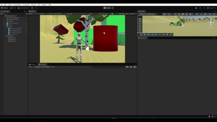

# Introducción a Unity
- Álvaro Pérez Ramos
- alu0101574042

## Descripción de la práctica
En esta práctica se trabajó con **Unity** para familiarizarnos con el editor, los objetos 3D básicos y el uso de paquetes de la Asset Store.  

### Elementos implementados
- **Incluir objetos 3D básicos.**  
  - Se añadieron los objetos: **Cubo**, **Cápsula** y **Cilindro**. Se les ha dado un material simple rojo.
  - Están agrupados en el objeto vació denominado "Basicos".
- **Incluir en el proyecto el paquete Starter Assets**
  - Se incluyó el paquete **[Starter Assets](https://assetstore.unity.com/packages/essentials/starter-assets-thirdperson-updates-in-new-charactercontroller-pa-196526?srsltid=AfmBOooOfzG9vjTZm_1M6-V6_A74crJlWHGpXM7b-TEFd1_TqJ9kxvkz)**   y se utilizó el prefab **Third Person Controller** para el personaje principal.  
  - También se han añadido dos prefabs de entorno: el edificio y las escaleras (Están agrupados en el objeto vació denominado "Casa"). También se les ha dado un material simple negro.
- **Incluir un objeto libre de la Asset Store que no sea de los Starter Assets.**  
  - Se descargaron y colocaron **árboles de [Pure Poly](https://assetstore.unity.com/publishers/49700)** desde la Asset Store.
  - Están agrupados en el objeto vació denominado "Trees".
- **Crear un terreno.**  
  - Se creó un `Terrain` y se le asignó un material llamado **Grass** con textura y relieve, aparte de usar la herramineta de modificar terreno para generar montañas.
- **Etiquetas**  
  - A cada objeto se le asignó un `Tag` descriptivo: `Respawn` (terreno), `Player` (personaje), `Casa`, `Tree`, `Basico_1`, `Basico_2`, `Basico_3`.
- **Script**  
  - Se creó un script llamado **[ObjectReporter](ObjectReporter.cs)** que al ejecutar la escena muestra en la consola la **etiqueta y posición** de cada objeto.

### Ejecución
A continuación se muestra un GIF con la ejecución del proyecto:

