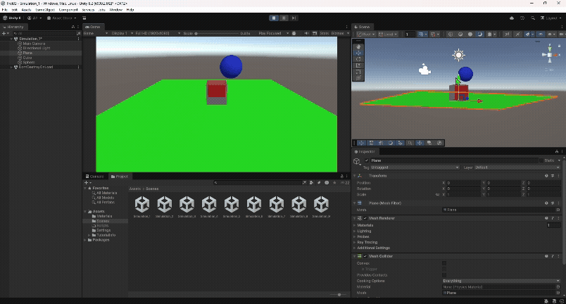
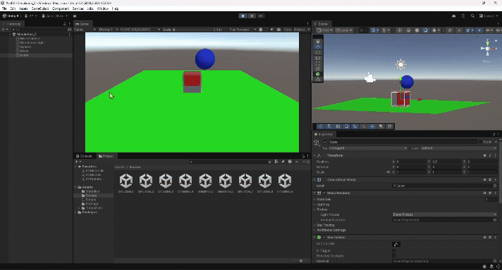
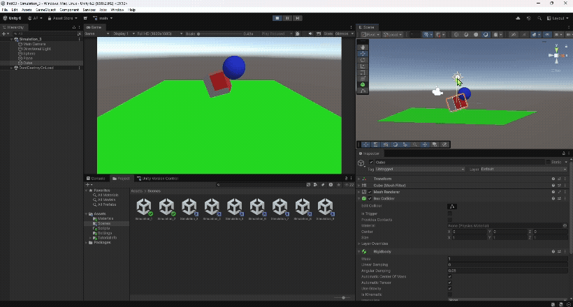
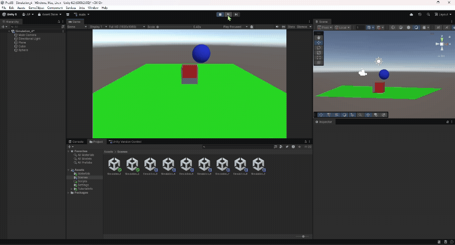
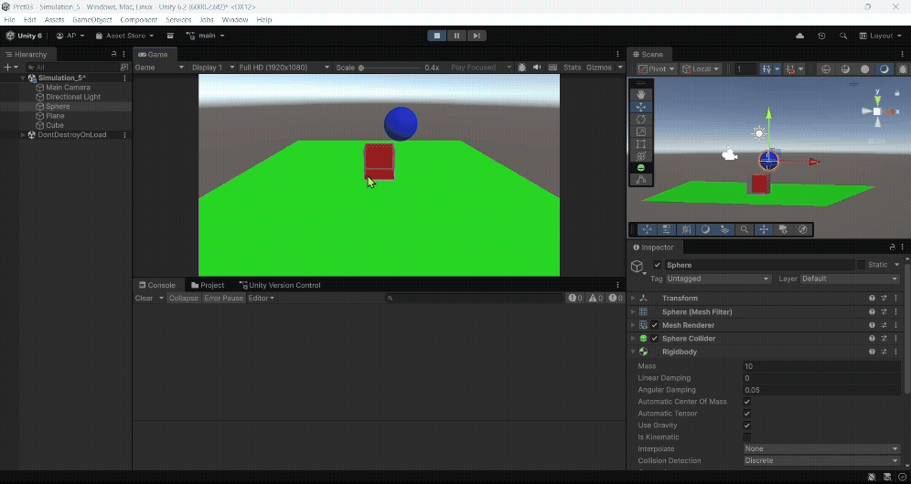
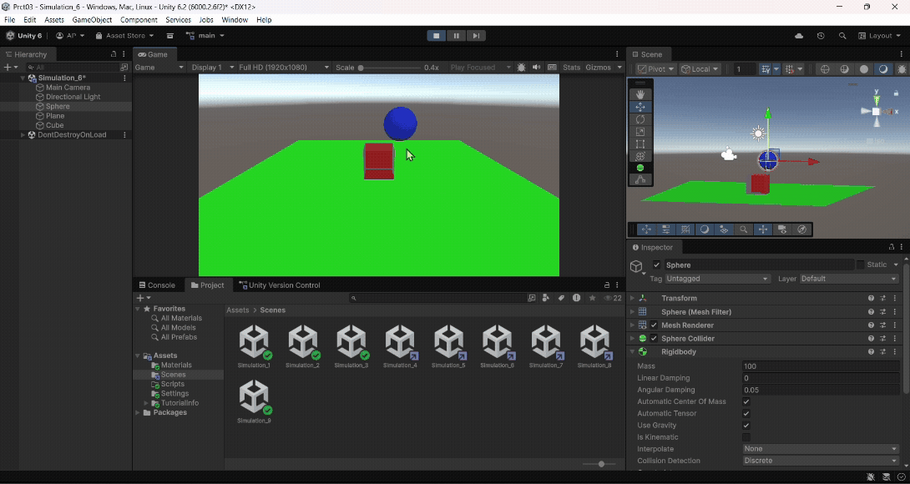
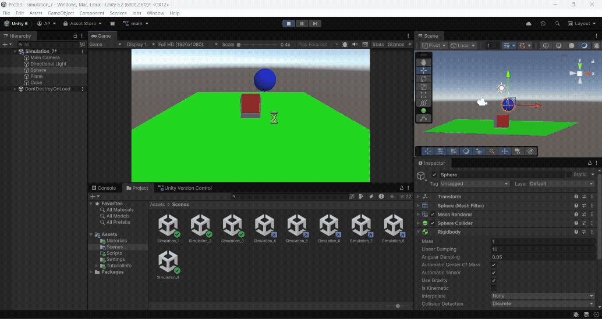
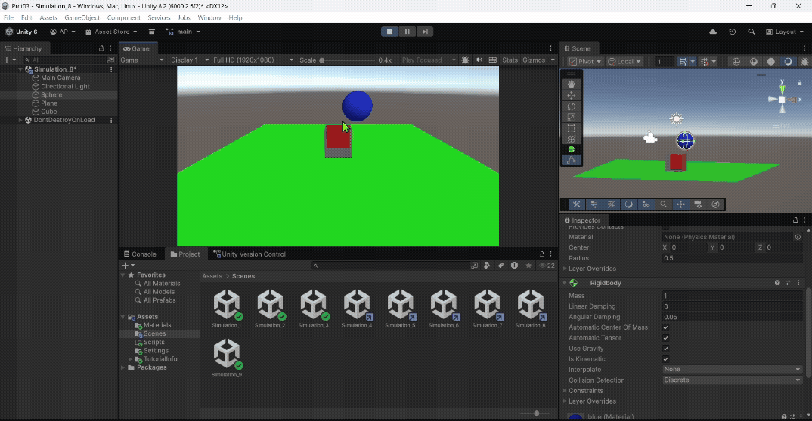
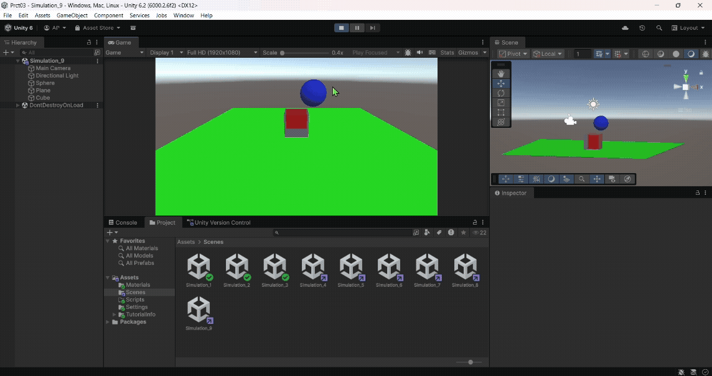

## Introducción a Scripts
* Álvaro Pérez Ramos
* alu0101574042@ull.edu.es

> [!WARNING]  
> Los gifs tardan un poco en cargar al abrirlo desde GitHub.

## Índice 

1. [Ejercicios de físicas 3d](#fisicas)
	* [Situación 1](#fisicas1)
	* [Situación 2](#fisicas2)
	* [Situación 3](#fisicas3)
	* [Situación 4](#fisicas4)
	* [Situación 5](#fisicas5)
	* [Situación 6](#fisicas6)
	* [Situación 7](#fisicas7)
	* [Situación 8](#fisicas8)
	* [Situación 9](#fisicas9)

2. [Ejercicios de la práctica 3](#practica)
	* [Ejercicio 1](#uno)
	* [Ejercicio 2](#dos)
	* [Ejercicio 3](#tres)
	* [Ejercicio 4](#cuatro)
	* [Ejercicio 5](#cinco)

## Tareas realizadas

### Ejercicios de físicas 3d 

#### Situación 1 

* El plano no es un objeto físico: tiene collider.
* La esfera no es un objeto físico: tiene collider.
* El cubo es un objeto físico: tiene rigidbody.

En este caso el cubo es el único que puede moverse por el motor de físicas (y chocar con el plano y la esfera).

    

#### Situación 2 

* El plano no es un objeto físico: tiene collider.
* La esfera es un objeto físico: tiene rigidbody.
* El cubo es un objeto físico: tiene rigidbody.

En este caso tanto el cubo como la esfera son movidos por el motor de físicas.

    

#### Situación 3 

* El plano no es un objeto físico: tiene collider.
* El cubo es un objeto físico: tiene rigidbody.
* La esfera es cinemática: isKinematic.

En este caso, la esfera a pesar de tener Rigidbody no puede ser movida por el motor de físicas.

   

#### Situación 4 

* El plano es un objeto físico: tiene rigidbody.
* La esfera es un objeto físico: tiene rigidbody.
* El cubo es un objeto físico: tiene rigidbody.

Al tener los tres comportamiento físico, se caen los tres.

    

#### Situación 5 

* El plano es un objeto físico: tiene rigidbody.
* La esfera es un objeto físico: tiene rigidbody.
* La esfera tiene 10 veces más masa que el cubo. 
* El cubo es un objeto físico: tiene rigidbody.

La esfera, a pesar de tener más masa no se mueve distinto, pues estamos en un entorno sin fricción (principio de equivalencia de Galileo, que establece que en ausencia de otras fuerzas, todos los cuerpos aceleran al mismo ritmo bajo la gravedad). Además, Unity ajusta automáticamente las velocidades usando el motor de física, por lo que aunque la masa afecta la inercia y la forma en que los objetos responden a las fuerzas, la velocidad final no depende de la masa en escenarios en los que las fuerzas aplicadas son uniformes y continuas. De hecho, si añadimos fricción podemos ver que la esfera "empuja" al cubo.

  

#### Situación 6 

* El plano es un objeto físico: tiene rigidbody.
* La esfera es un objeto físico: tiene rigidbody.
* La esfera tiene 100 veces más masa que el cubo. 
* El cubo es un objeto físico: tiene rigidbody.

Estamos ante el mismo caso que antes.

    

#### Situación 7 

* El plano es un objeto físico: tiene rigidbody.
* La esfera es un objeto físico: tiene rigidbody.
* La esfera es física con fricción.
* El cubo es un objeto físico: tiene rigidbody.

Al tener fricción la esfera, le cuesta más moverse.

   

#### Situación 8 

* El plano es un objeto físico: tiene rigidbody.
* La esfera no es un objeto físico: tiene collider.
* La esfera es trigger.
* El cubo es un objeto físico: tiene rigidbody.

En teoría, en esta configuración la esfera deja pasar objetos a través de ella. Sin embargo, por la situación actual no se da el caso. Es decir, la esfera está actuando esencialmente como un sensor (si algún objeto chocase con ella se podría detectar).

    

#### Situación 9 

* El plano es un objeto físico: tiene rigidbody.
* La esfera es un objeto físico: tiene rigidbody.
* La esfera es trigger.
* El cubo es un objeto físico: tiene rigidbody.

Aquí la situación parece exactamente igual a la de antes; sin embargo, la diferencia es que además de servir como trigger, la esfera se mueve. De hecho, en esta situación si el plano no fuera físico podemos ver que mueve el cubo y atraviesa el plano.

### Ejercicios de la práctica 

### Ejercicio 1 

* Se creó un personaje (Capsule o Cube) con `Rigidbody`.  
* Se controla su desplazamiento con las teclas **WASD** o las flechas.  
* El movimiento está influenciado por física (`Rigidbody.velocity`), pero el jugador mantiene el control total.  
* El script principal está en [PlayerMovement.cs](./src/PlayerMovement.cs).  
* Se corrigió el uso del nuevo sistema de Input ajustando **Active Input Handling → Both** en *Project Settings*.  
* Variables públicas: `speed`.  
* Métodos adicionales: `ChangeColor(Color)`, `ResetColor()`, `AddDamage(int)` — usados en ejercicios posteriores.

[Input](https://docs.unity3d.com/ScriptReference/Input.html)

---

### Ejercicio 2 

* Se crean por código varios cubos o esferas con `Rigidbody` dinámico.  
* Cada uno muestra por consola el nombre del objeto con el que colisiona.  
* Además, cambia de color al colisionar y vuelve a su color original al separarse.  
* Scripts principales:
  * [ChangeColorOnCollision.cs](./src/ChangeColorOnCollision.cs) — maneja las colisiones y los cambios de color.

---

### Ejercicio 3 

* Se crearon **zonas invisibles** (cubos con `Is Trigger = true`) que reaccionan al jugador.  
* Tipos de zonas:
  * Zona de color → cambia el color del personaje mientras esté dentro.
  * Zona de daño → incrementa la variable `damage` del jugador.  
* Scripts principales:
  * [PlayerMovement.cs](./src/PlayerMovement.cs) — incluye métodos de cambio de color y daño.
  * [ZoneEffect.cs](./src/ZoneEffect.cs) — gestiona los triggers y efectos.
* Las zonas se hacen invisibles desactivando el `Mesh Renderer` o usando un objeto vacío con `BoxCollider (Is Trigger)`.

---

### Ejercicio 4 

* Se configuraron **tres capas (Layers)**:
  * `Player`
  * `Enemy`
  * `Collectable`
* Se ajustó la **Layer Collision Matrix** en *Edit → Project Settings → Physics*:  
  * Los enemigos solo colisionan con el jugador.  
  * Los recolectables solo son detectados mediante triggers.  
* Scripts utilizados:
  * [PlayerMovement.cs](./src/PlayerMovement.cs)
  * [EnemyCollision.cs](./src/EnemyCollision.cs)
  * [CollectableTrigger.cs](./src/CollectableTrigger.cs)

---

### Ejercicio 5 

* Se crearon **tres Physic Materials**:
  * `Resbaladizo` → Fricción baja, sin rebote.
  * `Rugoso` → Alta fricción, sin rebote.
  * `ReboteAlto` → Fricción baja, rebote alto.
* Cada objeto tiene asignado un material diferente.  
* Al presionar la tecla **X**, los objetos son lanzados usando `AddForce()`.  
* Scripts principales:
  * [ObjectLauncher.cs](./src/ObjectLauncher.cs) — aplica la fuerza con `AddForce()`.

[Physic Material](https://docs.unity3d.com/Manual/class-PhysicMaterial.html)

---
