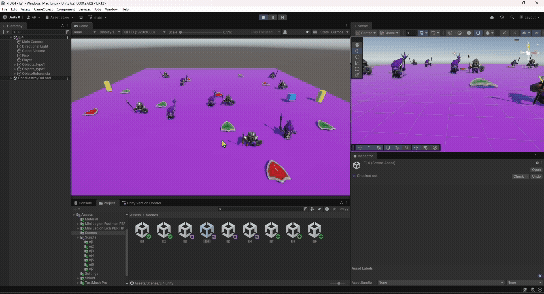
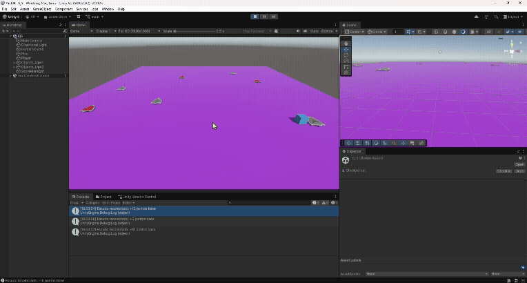

## Introducción a scripts
* Álvaro Pérez Ramos
* alu0101574042@ull.edu.es

> [!WARNING]  
> Los gifs tardan un poco en cargar al abrirlo desde GitHub.
1. [Ejercicios de la práctica 4](#practica)
    1. [Ejercicio 1](#uno)
    2. [Ejercicio 2](#dos)
    3. [Ejercicio 3](#tres)
    4. [Ejercicio 4](#cuatro)
    5. [Ejercicio 5](#cinco)
    6. [Ejercicio 6](#seis)
    7. [Ejercicio 7](#siete)
    8. [Ejercicio 8](#ocho)
    9. [Ejercicio 9](#nueve)

## Tareas realizadas

### Ejercicios de la práctica <div id='practica'/>

#### Ejercicio 1 <div id='uno'/>

* Cubo 
  * Movimiento cinemático: [PlayerMovement](./scripts/PlayerMovement.cs)
  * Notificador: [Notificador](./scripts/ej1/Notificador.cs)
* Esferas de tipo 1
  * Suscriptoras: [SphereTipo1](./scripts/ej1/SphereTipo1.cs)
* Esferas de tipo 2
  * Suscriptoras: [SphereTipo2](./scripts/ej1/SphereTipo2.cs)

* Funcionamiento:
  * Cuando el cubo colisiona con el cilindro:
    * Las esferas de tipo 1 se dirigen hacia una esfera de tipo 2
    * Las esferas de tipo 2 se desplazan hacia el cilindro

[Collider](https://docs.unity3d.com/ScriptReference/Collider.html)    
[OnTrigger events](https://docs.unity3d.com/Manual/collider-interactions-ontrigger.html)

   

#### Ejercicio 2 <div id='dos'/>

* Sustituir las esferas por Humanoides

Cubo: [Notificador2](./scripts/ej2/Notificador2.cs)
Humanoide_Tipo1 : [Respuesta_Tipo1](./scripts/ej2/HumanoideTipo1.cs)
Humanoide_Tipo2 : [Respuesta_Tipo2](./scripts/ej2/HumanoideTipo2.cs)

 

[Humanoides_Tipo1](https://assetstore.unity.com/packages/3d/characters/humanoids/fantasy/mini-legion-footman-pbr-hp-polyart-86576)

[Humanoides_Tipo2](https://assetstore.unity.com/packages/3d/characters/humanoids/fantasy/mini-legion-lich-pbr-hp-polyart-91497)

#### Ejercicio 3 <div id='tres'/>

* [Escudo](https://assetstore.unity.com/packages/3d/characters/humanoids/fantasy/mini-legion-lich-pbr-hp-polyart-91497)
> Al escudo le di un nuevo material para identificar lot tipo 1 de los tipo 2
[Base](./BaseShields/Shield_Diffuse.png)
[Mmodificado](./BaseShields/Shield_Diffuse2.png)

* Cuando el cubo colisione con un humanoide del tipo 2:
  * Las del tipo 1 van hacia un escudo del tipo 1.
* Cuando el cubo colisiones con un humanoide del tipo 1:
  * Los del tipo 1 van hacia un escudo del tipo 2.
  * Si tocan uno, deben cambiar de color.

Cubo: [Notificador3](./scripts/ej3/Notificador3.cs)
[ComportamientoHumanoide](./scripts/ej3/ComportamientoHumanoide.cs)


#### Ejercicio 4 <div id='cuatro'/>

* Cubo: [Notificador4](./scripts//ej4/Notificador4.cs)
* [Teleport](./scripts/ej4/Teleport.cs)

* Cuando el cubo colisione con el cilindro:
  * Los humanoides del grupo 1 se teletransportan a un escudo fijado.
  * Las humanoides del grupo 2 se orientan hacia un escudo fijado adicional se teletransportan.

> Se usa una instancia de `ComportamientoHumanoide` pues si ya en este teng asignado los escudos a donde se dirigen simplemente le digo que de extra se haga un teletransporte cuando se toqeu el controlador requerido

   

#### Ejercicio 5 <div id='cinco'/>

> [!WARNING]  
> Se han quitado los Humanoides para mejorar la visualizacion.

* Añadir una puntuación para el jugador: [ScoreManager](./scripts/ej5/ScoreManager.cs) [ShieldCollectible]((./scripts/ej5/ShieldCollectible.cs))
  * Los escudos de tipo 1 suman 5 puntos.
  * Los escudos de tipo 2 suman 10 puntos.

   

#### Ejercicio 6 <div id='seis'/>

> [!WARNING]  
> Se han quitado los Humanoides para mejorar la visualizacion.

* Interfaz que muestre la puntuación: 
* Se hace soporte con [ScoreManager2](./scripts/ej6/ScoreManager2.cs) [UIManager](./scripts/ej6/UIManager.cs)

Y un pueño cambio en el `ShieldCollectable` en el OnTiggerEnter() cambiamos de 

```C#
ScoreManager scoreManager = FindFirstObjectByType<ScoreManager>();
ScoreManager2 scoreManager = FindFirstObjectByType<ScoreManager2>();
```
[Canvas](https://docs.unity3d.com/ScriptReference/Canvas.html)

   

#### Ejercicio 7 <div id='siete'/>

* Cada 100 puntos da una mejora:

Las posibles mejoras son:
  * Mejorar la velocidad del cubo en 0.01
  * Mejorar los puntos ganados en 0.01
  * Reducir el tiempo de restpawn de los escudos en 0.01

Para hacer esto posible se necestió que volvieran a aparecer los escudos.
* La lógica del respawn está en [ShieldRespawnManager](./scripts/ShieldRespawnManager.cs)

Para la aparición de los nuevos textos se tocó el UIManager, así como el comportamiento de los humanoides al qeuidarse sobre los escudos no se reseteba el color al estar en OnTarget(), además se debió tocar el sistema de puntos pues hay potenciadores.
* Archivos modificaods [UIManager2](./scripts/ej7/UIManager2.cs), [ComportamientoHumanoide](./scripts/ej7/ComportamientoHumanoide2.cs) y  [ScoreManager3](./scripts/ej7/ScoreManager3.cs)

Además de tenre un controlador para ello [GameManager ](./scripts/GameManager.cs)


   

#### Ejercicio 8 <div id='ocho'/>

* Escena:
  * Humanoide_Tipo1 van a escudos_Tipo1 analogo a Humanoide_Tipo2 y escudos_Tipo2
  * Los escudos se recolecatan, suman puntuación y reaparecen después de un tiempo en un sitio dentro del terreno, siempre y cuendo no este ahí el jugador, humanoides o ya exitea un escudo. 
  * Los Humanoides intentarán ir a por su escudo y si lo consiguen, cambian su color y permanecen en el escudo un tiempo hasta que este se teletransporta de nuevo. Los humanoides son más lento que el jugador.
  * Si todos los Humanoides llegan a sus escudos has perdido

* Mecánicas:
  * Logica en [GameManager2.cs](.scripts/GameManager2.cs) y [ShieldRespawnManager2](./scripts/ShieldRespawnManager2.cs)
  * Para el resto se usó [ScoreManager4](./scripts/ej8/ScoreManager4.cs), [ScoreManagShieldCollectible4](./scripts/ej8/ShieldCollectible4.cs) y [UIManager3](./scripts/ej8/UIManager3.cs)

   

#### Ejercicio 9 <div id='nueve'/>

* Implementar el ejercicio 3 siendo el cubo un objeto físico. [MovimientoFisicas2](./scripts/PlayerMovement2.cs)

   