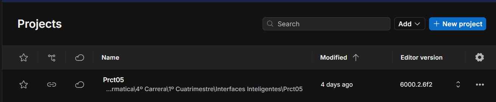
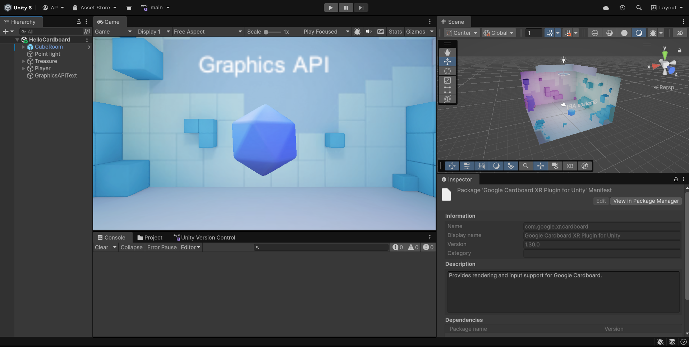

# Escenas cardboard
* Álvaro Pérez Ramos
* alu0101574042@ull.edu.es

## Guía de inicio rápido de Google Cardboard para Unity

1. [Configurar el entorno de desarrollo](#entorno)
2. [Importar el SDK y crear un nuevo proyecto](#sdk)
3. [Configurar escena](#escena)
4. [Configurar proyecto de Android](#android)
5. [Activar y desactivar](#activar)

### Configura tu entorno de desarrollo 

* Compatibilidad Android instalada
* Git instalado

### Importa el SDK y crea un proyecto nuevo 

* Abrir Unity y crear un proyecto 3D.

* Ir a Window > Administrador de paquete
* Darle a + y seleccionar Add package from git URL

* Instalar de `https://github.com/googlevr/cardboard-xr-plugin.git`
* Ir al `Google Cardboard XR Plugin` en Unity package
* En el apartado de `Samples`, elegimos `Import into Project`

* El ejemplo se carga en `Assets/Samples/Google Cardboard/<version>/Hello Cardboard`

### Cómo configurar una escena de HelloCardboard 

* Ir a `Assets/Samples/Google Cardboard/<version>/Hello Cardboard/Scenes`
* Seleccionar `Add Open Scenes`
* Elegir `HelloCardboard` para abrir la escena de ejemplo

* Abrir `Layers` en el menú y seleccionar `Edit Layers`

* Añadir una nueva capa llamada "Interactive"

* Seleccionar `Treasure` GameObject para abrir el `Inspector` window
* Poner como su layer `"Interactive"`
* Si sale un pop-up, marcar `"Yes, change children"`

* Hacer clic en `Player > Camera > CardboardReticlePointer` GameObject para abrir el Inspector 
* En el script `"Carboard reticle pointer"`, seleccionar "Interactive" como el `Reticle Interaction Layer Mask`

### Cómo establecer la configuración del proyecto de Android 

* Navegar a `File > Build Settings`
  * Seleccionar `Android` y elegir `Switch Platform`
  * Seleccionar `Add Open Scenes` y elegir `HelloCardboard`

* Navegamos a `Edit > Project Settings > Player > Resolution and Presentation`
  * Marcar `Default Orientation` a `Landscape Left` o `Landscape Right`
  * Desactivar `Optimized Frame Pacing`

* Navegamos a `Edit > Project Settings > Player > Other Settings`
  * Choose OpenGLES2, OpenGLES3, or Vulkan, or any combination of them in Graphics APIs.
  * Select Android 8.0 'Oreo' (API level 26) or higher in Minimum API Level.
  * Select API level 33 or higher in Target API Level.
  * Select IL2CPP in Scripting Backend.
  * Select desired architectures by choosing ARMv7, ARM64, or both in Target Architectures.
  * Select Require in Internet Access.
  * Specify your company domain under Package Name.
  * If Vulkan was selected as Graphics API:
    * Uncheck Apply display rotation during rendering checkbox in Vulkan Settings.
    * If the Unity version is 2021.2 or above, Select ETC2 in Texture compression format.
  * If the Unity version is 2023.1 or later, select Activity and clear GameActivity in Application Entry Point.
* Cambiar los settings de publicación
* Hacer el build

